<h1 align="center"><strong> :cupid: The Love Bugs :cupid: </strong></h1>

<h1 align="center"><strong> :revolving_hearts: Miles & Smiles :revolving_hearts: </strong></h1>

# **Intro**

Welcome to "Miles and Smiles"! This is more than just an app - it's a bridge to unite hearts separated by distance. If you're in a long-distance relationship, you know how challenging it can be to maintain connection and intimacy. That's why we created "Miles and Smiles", a tool designed especially for couples who want to feel closer, regardless of the distance that separates them. With intuitive and user-friendly features, we're here to turn every mile traveled into shared smiles. Explore all that "Miles and Smiles" has to offer and embark on this journey of long-distance love with confidence and joy.

Live link: [Miles & Smiles](https://miles-smiles-8a9dbd072758.herokuapp.com/)


# Table Of Content

-   [User Experience](#user-experience)
    -   [User Stories](#user-stories)
    -   [Site Goals](#site-goals)
    -   [Scope](#scope)
-   [Design](#design)
    -   [Colour Scheme](#colour-scheme)
    -   [Fonts](#Fonts)
    -   [Wireframes](#Wireframes)
    -   [Agile Methodology](#Agile-Methodology)
         -   [Overview](#overview)
         -   [EPICS(Milestones)](#epicsmilestones)
         -   [User Stories issues](#user-stories-issues)
         -   [GitHub Projects](#github-projects)
-   [Features](#features)
    -   [Navbar](#Navbar)
    -   [Footer](#Footer)
    -   [Home](#Home)
       
-   [Future Features](#future-features)
-   [Testing](#testing)
-   [Bugs](#Bugs)
-   [Technologies And Languages](#technologies-and-languages)
    -   [Languages Used](#languages-used)
    -   [Technologies and programs](#technologies-and-programs)
-   [Deployment](#deployment)
    -   [Creating A Fork](#creating-a-fork)
    -   [Cloning Repository](#cloning-repository)
-   [Credits](#credits)
    -   [Media](#media)
    -   [Code](#code)
    -   [Acknowledgements](#acknowledgements)
    -   [Comments](#comments)


## User Experience

### User Stories

###[#45](https://github.com/VCGithubCode/the-love-bugs/issues/45)

###[#44](https://github.com/VCGithubCode/the-love-bugs/issues/44)

 ###[#34](https://github.com/VCGithubCode/the-love-bugs/issues/34)

#### Site-goals 
* Provide a system to allow users to see a countdown based on their planned meeting date and their geo-location.
* Allow users to create a profile to enter relationship details.
* Responsive application, based on Hackathon judging criteria, where a CSS framework is used and Valentine's day is the theme .

#### Agile Methodology
The project was developed by using agile methodologies. The development cycle was divided into short sprints, where code was delivered in small chunks for flexibility and good coding practice.
Furthermore, the branch system and forking was used to simulate a real-world developer team environment.

The Kanban board was created to keep track of project progression and issues assessment. Issues were given acceptance criteria and were split into tasks if feasible.


## The Scope Plane
* Responsive design - website should support devices from 320px up
* Hamburger menu for mobile devices
* Interactive World Map with minimally invasive information details about couples relationships
* Shopping cart for users that want to buy gifts

#### Target Audience
The target audience for "Miles and Smiles" is couples who are in long-distance relationships. This includes people of all ages who are separated by significant distances due to reasons such as work, studies or other circumstances. These couples are looking for ways to maintain a close connection, despite the physical distance, and are interested in tools that help them overcome the unique challenges faced in long-distance relationships. The app is especially suitable for those who want to feel closer to their partners, sharing special moments, planning future meetings and creating memories together, regardless of the distance that separates them.

## Design
### Colour Scheme


### Wireframes
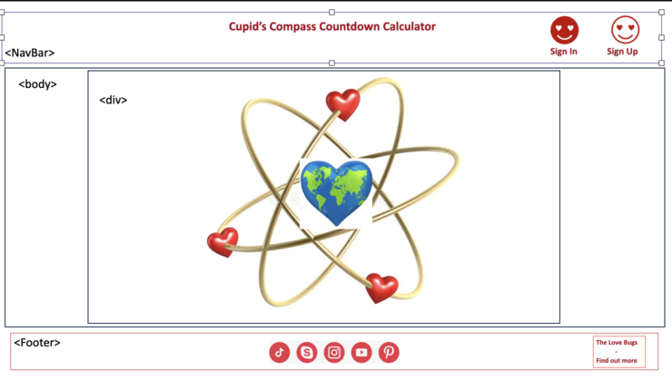

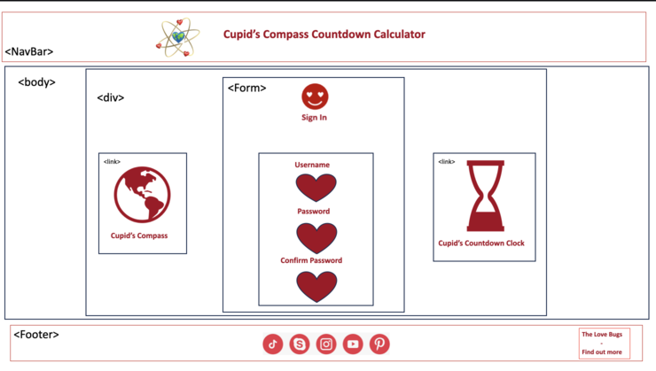
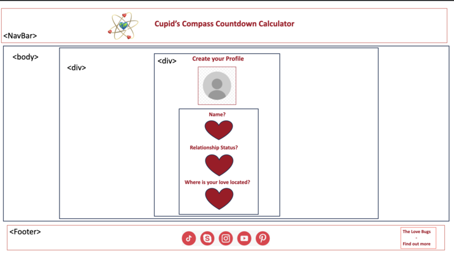
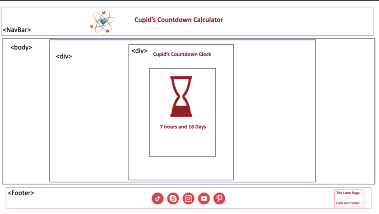

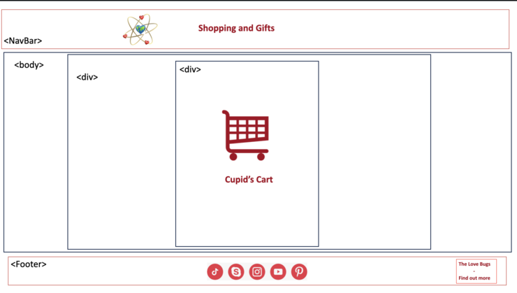

#### Mockups
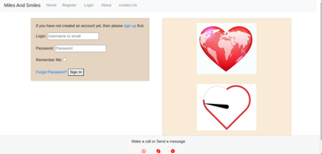<br>
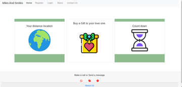<br>


#### EPICS(Milestones) / User Stories issues
###[#45](https://github.com/VCGithubCode/the-love-bugs/issues/45)

###[#44](https://github.com/VCGithubCode/the-love-bugs/issues/44)

 ###[#34](https://github.com/VCGithubCode/the-love-bugs/issues/34)

#### GitHub Projects

## Features
### Navbar
The navbar consists of:
- App name,
- Links: 
    - Home (go to home page),
    - Register (for the user to register in the app),
    - Login (for the user to log in to their account), 
    - About (where the user can see the team that developed the project), 
    - Contact Us (form for the user to contact our team and ask for assistance or a question). 
- Navbar without Login:


- Navbar with login:


### Footer
The footer consists of:
- Two buttons: 
    - The githube symbol that takes the user to the code source page on githube, 
    - The group symbol that takes you to the team page.
- Copyrights and the team name. 


### Home
The home page contains a map, and after logging in the user can see two points on the map (two locations). His location and his lover's location. 
You can also find a form to enter this data.
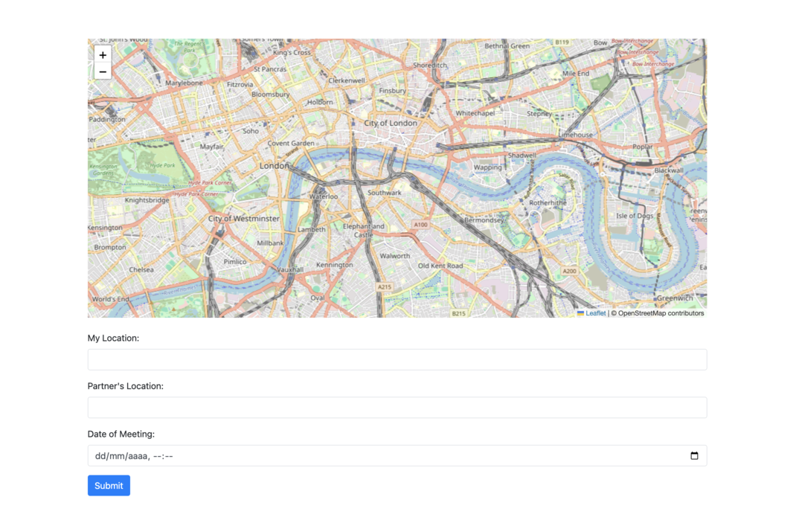

### Sign Up Page
On the Sign Up page you can use the application's login option.

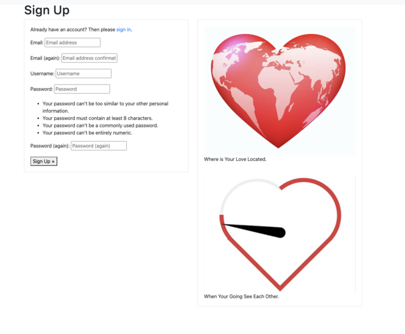
### Sign In Page
On the Sign in page, the user can log in to access their account.

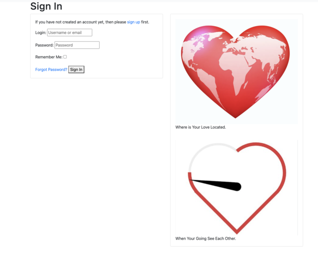
### About
On the About page, the user can find the team that developed the app, with some individual links for each social network.

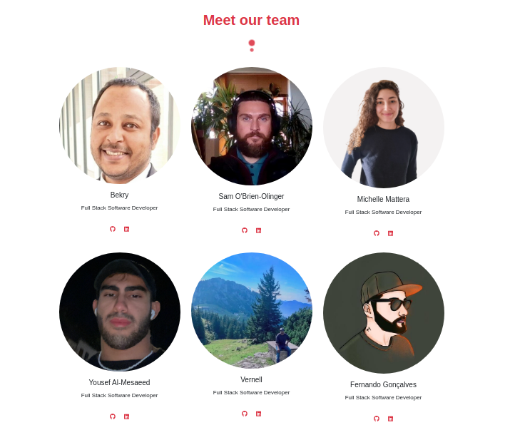
### Contact Us
On the Contact us page, the user can fill out a form to get in touch with the team for any questions or support needed while using the app.

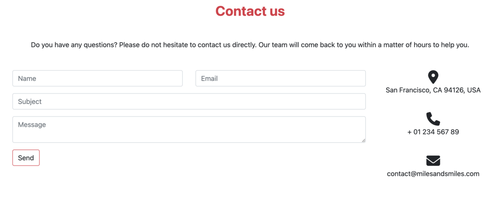

### User Profile 
Here the user can delete their personal profile or edit it.
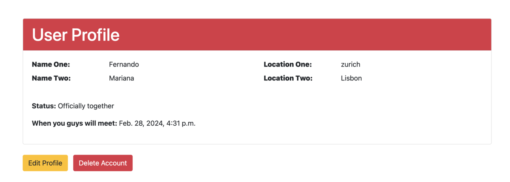

### Sign Out
Message to confirm whether the user wants to Sign Out.
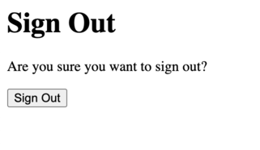

### Creat Profile
On this page, the user can create their profile with location and relationship data.


### Delete Profile 
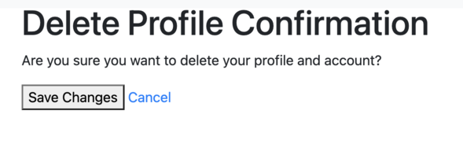

## Future Features
1. Countdown Page 
2. Shopping gifts
3. Localization pin

## Testing
Testing documentation can be found [here.](./TESTING.md)

## Bugs

|Bug|Status|
| ---| ---|
|[BUG: Bug with Google API](staticfiles/images/readme_img/google_api_error.png)|Open|
|[BUG: bug description](link)|Open|

### Version control
The website was created in Virtual Studio Code editor, and changes were pushed to the GitHub repository by using bash terminal. 

The following commands were used:

```git status``` - This command was used to check files staged and not staged for commit

```git add <file.extension>``` -  This command was used to add changes in file/files, with particular names and extensions, to be staged for commit

```git add .``` - This command was used to add changes in all files, regardless of name and extension, to be staged for commit

```git commit -m "commit message"``` - This command was used to commit all staged changes to a local repository

```git push``` - This command was used to upload all committed locally changes to a GitHub repository

```git pull``` - This command was used to pull changes from remote repository into local repository

```git checkout``` - This command was used to switch between branches 

## Technologies And Languages
### Languages Used
- **HTML 5**
- **CSS 3**
- **Javascript**
- **Python**
- [Bootstrap](https://getbootstrap.com/) - Responsive layout and styling
- **Django**
- [GitHub](https://github.com) - Version control and deployment
- [Font Awesome](https://fontawesome.com/) - Icons

### Technologies and programs
- [GitHub](https://github.com/) is the hosting site used to store the code for the website.
- [Git](https://git-scm.com/) was used as a version control software to commit and push the code to the GitHub repository.
- [Microsoft Powerpoint](https://www.microsoft.com/en-us/microsoft-365/powerpoint) was used for creating the mockup images of the website during planning stage.
- [Google Chrome Lighthouse](https://developers.google.com/web/tools/lighthouse) was used during the testing of the website.
- [Google Chrome Developer Tools](https://developer.chrome.com/docs/devtools/overview/) was used during testing, debugging and making the website responsive.
- [W3C HTML Validator](https://validator.w3.org/) was used to check for errors in the HTML code.
- [W3C CSS Validator](https://jigsaw.w3.org/css-validator/) was used to check for errors in the CSS code
- [Js Hint](https://jshint.com/) was used to validate the JavaScript code.
- [CI Python Linter](https://pep8ci.herokuapp.com/) was used to check the Python code.

## **Deployment**

Live link: [Miles & Smiles](https://miles-and-smiles-03ded9dd0f57.herokuapp.com/)

### Deployment Steps
- Install Git and the Heroku CLI (Command Line Interface) on your local machine if you haven't already.
- Navigate to your project's root directory using the command line.
- Initialize a local Git repository and commit your application code to it:

    $ cd example-app
    $ git init
    $ git add .
    $ git commit -m "My first commit"

    Created initial commit 5df2d09: My first commit
    44 files changed, 8393 insertions(+), 0 deletions(-)
    create mode 100644 README
    create mode 100644 Procfile
    create mode 100644 app/controllers/source_file

- Create a new Heroku app with the heroku create command (use -a to specify an app name):

    $ heroku create -a example-app
    Creating app... done, ⬢ example-app

- Verify the Heroku remote has been set for your local repository:

    $ git remote -v

- Deploy your app to Heroku using the git push heroku main command (or git push heroku <branch-name>:main for a non-main branch):

    $ git push heroku main
    Initializing repository, done.
    updating 'refs/heads/main'

- You can confirm the deployment by running heroku ps:scale web=1 and heroku open.


### Creating a fork
1. Navigate to the [repository](https://github.com/VCGithubCode/the-love-bugs)
2. In the top-right corner of the page click on the fork button and select create a fork.
3. You can change the name of the fork and add description 
4. Choose to copy only the main branch or all branches to the new fork. 
5. Click Create a Fork. A repository should appear in your GitHub

### Cloning Repository
1. Navigate to the [repository](https://github.com/VCGithubCode/the-love-bugs)
2. Click on the Code button on top of the repository and copy the link. 
3. Open Git Bash and change the working directory to the location where you want the cloned directory. 
4. Type git clone and then paste the link.
5. Press Enter to create your local clone.

## Credits
### Media
- [Openart.ai](https://openart.ai/) - Images to Sign pages
- [Font Awesome](https://fontawesome.com/) - Icons
### Code
- [Bootstrap](https://getbootstrap.com/) - Responsive layout and styling

### Comments

- Credits and thank you to our team ***The Love Bugs*** for great teamwork during the project and effective communication via our Slack channel chat and calls:
- [Michelle](https://github.com/michmattera) <br>
- [Sam](https://github.com/SamOBrienOlinger)<br>
- [Yousef](https://github.com/yousefalm1)<br>
- [Bekry](https://github.com/bky201)<br>
- [Fernando](https://github.com/Goncalves95)<br>
- [Vernell](https://github.com/VCGithubCode)